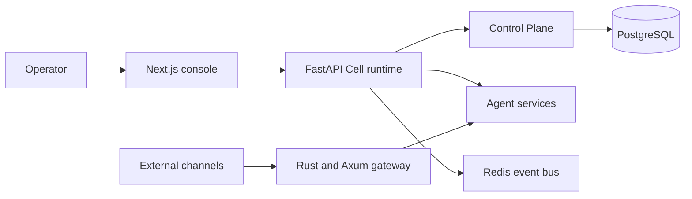

# Wisdoverse Cell

[](https://github.com/Wisdoverse/Wisdoverse-Cell/actions/workflows/ci.yml)
[](./LICENSE)
[](./pyproject.toml)
[](./rust-toolchain.toml)

Wisdoverse Cell is a self-hosted control plane for AI-native company operations. It connects goals, work items, agent roles, runs, approvals, budgets, artifacts, and audit records.

People set direction and review sensitive decisions. Agent services perform operational work through governed execution paths that record evidence and cost.

> [!WARNING]
> Wisdoverse Cell is an engineering preview for trusted development and evaluation environments. Review [SECURITY.md](./SECURITY.md) before any production-like deployment.

## ✨ What it provides

- **Governed work:** Track goals, work items, role ownership, approvals, and budgets in the Control Plane.
- **Agent execution:** Run agent services through HTTP and gated local-process adapters.
- **Reviewable outcomes:** Link runs to artifacts, cost usage, and audit records.
- **Operator surfaces:** Manage work through the API and Next.js operator console.
- **Integration foundations:** Connect runtime services through documented HTTP and event contracts.

These are implemented foundations. See the [roadmap](./docs/overview/roadmap.md) for acceptance work that remains open.

## 🧭 Architecture



The default deployment runs `cell`, `gateway`, `web`, `traefik`, and infrastructure. See the [architecture overview](./docs/overview/architecture.md) for service boundaries and deployment details.

## 🚀 Quick start

Run the reference implementation with Docker Compose. Host Python, Rust, and Node.js are not required for this path.

**Requirements:** Docker with the Compose plugin, GNU Make, Git, and a supported host operating system.

```bash
git clone https://github.com/Wisdoverse/Wisdoverse-Cell.git
cd Wisdoverse-Cell
cp .env.example .env
```

Before startup, set a strong `POSTGRES_PASSWORD` and `AUTH_SECRET` in `.env`.
Add provider keys for model-backed agent features.
Keep `.env` private.

```bash
make up
make ps
```

Open [http://localhost](http://localhost) for the operator console.
Control Plane access requires feature configuration, operator credentials, and internal tokens.
Follow the [operations guide](./docs/guides/operations.md) to configure them.
Use `make logs` to inspect service output.
Use `make down` to stop the stack.

## 🛠️ Local development

Install the relevant host tools only when you work on that component:

- Python 3.11 or later for the agent runtime and backend.
- Rustup and the Protocol Buffers compiler (`protoc`) for the gateway.
  [`rust-toolchain.toml`](./rust-toolchain.toml) selects Rust 1.99.0.
- Node.js 24 or later for the frontend.
- Docker Compose for local infrastructure and full-stack workflows.

Create `.env` from `.env.example`.
Before starting infrastructure, set `POSTGRES_PASSWORD` in `.env`.

Prepare the Python environment:

```bash
make setup
source .venv/bin/activate
make up-infra
make dev
```

The agent health endpoint is [http://localhost:8000/health](http://localhost:8000/health). For component commands, environment options, and service ports, see the [operations guide](./docs/guides/operations.md).

## 📚 Documentation

| Guide | What it covers |
|---|---|
| [Product model](./docs/overview/product-model.md) | Control Plane objects and current operator surfaces |
| [Architecture](./docs/overview/architecture.md) | Runtimes, contracts, and system boundaries |
| [Roadmap](./docs/overview/roadmap.md) | Implemented foundations, open acceptance, and delivery priorities |
| [Operations](./docs/guides/operations.md) | Local and production-like commands, ports, and deployment options |
| [API reference](./docs/guides/api-reference.md) | HTTP routes and service interfaces |
| [Documentation index](./docs/INDEX.md) | Guides, architecture records, and evidence |

### Contracts and agent handoff

| Document | Use it for |
|---|---|
| [SPEC.md](./SPEC.md) | Service contract, domain model, and requirements |
| [AGENTS.md](./AGENTS.md) | Repository rules and required references |
| [Agent development guide](./docs/guides/agent-development.md) | Agent service patterns, tests, and deployment steps |

## 🤝 Development and contribution

Read [CONTRIBUTING.md](./CONTRIBUTING.md) for setup, code standards, test targets, and pull requests. Run `make test-public` before each pull request. For Rust changes, run formatting, tests, and Clippy as the guide requires.

Use [GitHub Issues](https://github.com/Wisdoverse/Wisdoverse-Cell/issues) for reproducible defects and focused proposals. Use [GitHub Discussions](https://github.com/Wisdoverse/Wisdoverse-Cell/discussions) for open design questions. Follow the [Code of Conduct](./CODE_OF_CONDUCT.md) in project spaces.

## 🔐 Security and support

Report suspected vulnerabilities through the private process in [SECURITY.md](./SECURITY.md). Do not report security issues in public discussions, issues, or pull requests.

See [SUPPORT.md](./SUPPORT.md) for questions, discussions, and commercial inquiries.

## 🗺️ Engineering preview

This repository contains implemented product foundations and active engineering work. Synthetic checks and local evidence do not establish a live business pilot, deployment acceptance, or production readiness. Review the [roadmap](./docs/overview/roadmap.md) for current status and remaining gates.

## ⚖️ License

Wisdoverse Cell is source-available under the Wisdoverse Cell Business Source License 1.1 (`LicenseRef-Wisdoverse-Cell-BSL-1.1`). Each version automatically converts to the Apache License 2.0 four years after its first public release. The license restricts certain commercial and production uses before that change date. Read [LICENSE](./LICENSE) for the full terms.
