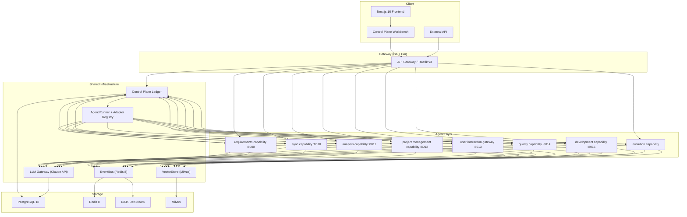

# Wisdoverse Cell Documentation

Wisdoverse Cell is an AI-native company control plane: humans focus on high-leverage decisions while agents handle repeatable execution.

This documentation is English-first. New documentation, edits to existing
documentation, runbooks, API descriptions, prompts, and comments should use
English as the primary language. Non-English text is reserved for locale files,
quoted source content, external platform field names, and multilingual fixtures.

For the current implementation contract, start with [SPEC.md](../SPEC.md).

---

## Product Model

Wisdoverse Cell should be read as a company operating system, not only as a collection of agent services. The public product surface is organized around goals, agent roles, work items, agent runs, approvals, budgets, and audit trails.

```text
Mission -> Goals -> Work Items -> Agent Runs -> Decisions -> Audit Trail
```

See [Product Model](overview/product-model.md) for the control-plane vocabulary and roadmap.

---

## Architecture



---

## Quick Start

```bash
make setup        # Install dependencies
make up-infra     # Start PostgreSQL, Redis, NATS, and Milvus
make dev          # Start the development server
```

Enable the control-plane surface only after migrations are applied:

```bash
CONTROL_PLANE_ENABLED=true
CONTROL_PLANE_COMPANY_ID=cmp_projectcell
```

Production deployments should keep local execution adapters disabled unless an
explicit allowlist has been reviewed.

---

## Agent Matrix

This table lists deployed service modules and gateways. CEO/CTO/CPO/COO-style
company roles are persisted `AgentRole` records in the control plane, not the
same thing as these service modules.

| Runtime Package | Kind | Description | Default Boundary | Status |
|-----------------|------|-------------|------------------|--------|
| `agents.capabilities.requirements` | Capability module | Requirement extraction, confirmation, and PRD generation | HTTP `:8000` | Active |
| `agents.capabilities.sync` | Capability module | Bidirectional context sync between OpenProject and Feishu | HTTP `:8010` | Active |
| `agents.capabilities.analysis` | Capability module | Risk detection and data analysis | HTTP `:8011` | Active |
| `agents.capabilities.project_management` | Capability module | Task breakdown, approval preparation, alerts, and reports | HTTP `:8012` | Active |
| `agents.gateways.user_interaction` | Integration gateway | User-facing reception and routing surface | HTTP `:8013` | Active |
| `agents.capabilities.quality` | Capability module | Automated code quality and acceptance checks | HTTP `:8014` | Active |
| `agents.capabilities.development` | Capability module | AgentForge-backed software delivery workflow execution | HTTP `:8015` | Active |
| `agents.orchestration.coordinator` | System worker | Event routing and decision synthesis | `create_agent_app()` service boundary | Active |
| `agents.capabilities.evolution` | Capability module | Self-evolution analysis and recommendations | Standalone `create_agent_app()` service boundary | Active |
| `agents.gateways.channel` | Integration gateway | Multi-channel inbound/outbound messaging adapter layer | EventBus and adapter boundary | Active |

---

## Self-Evolution Tiers

| Tier | Name | Focus |
|------|------|-------|
| L1 | Skill optimization | Prompt and skill refinement per agent |
| L2 | Architecture optimization | Structural improvements across agents |
| L3 | Collaboration optimization | Multi-agent team coordination |

---

## Tech Stack

| Layer | Technology | Role |
|-------|------------|------|
| Frontend | Next.js 16, React 19 | Web UI |
| Gateway | Go, Gin, Traefik v3 | API routing and load balancing |
| Agents | Python, FastAPI | Async agent runtime |
| LLM | Claude API | Reasoning engine |
| Messaging | Redis 8, NATS JetStream | EventBus and async messaging |
| Vector DB | Milvus | Embedding storage and retrieval |
| Database | PostgreSQL 18 | Persistent storage |
| Validation | Pydantic v2 | Schema and data validation |

---

## Documentation Index

See [docs/INDEX.md](INDEX.md) for the full documentation map.

---

## License

Wisdoverse Cell is source-available under the Wisdoverse Cell Business Source
License 1.1 (`LicenseRef-Wisdoverse-Cell-BSL-1.1`). Each version
automatically becomes available under the Apache License, Version 2.0 four
years after that version is first made publicly available. See
[../LICENSE](../LICENSE).
