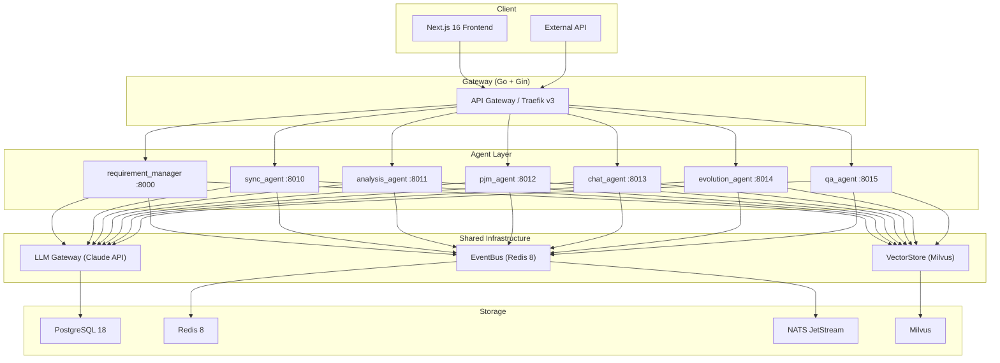

# Wisdoverse Cell Documentation

Wisdoverse Cell is an AI-native company control plane: humans focus on high-leverage decisions while agents handle repeatable execution.

This documentation is English-first. Chinese text may remain in legacy specifications or domain terminology, but new and public-facing documentation should put English first.

---

## Product Model

Wisdoverse Cell should be read as a company operating system, not only as a collection of agent services. The public product surface is organized around goals, agent roles, work items, agent runs, approvals, budgets, and audit trails.

```text
Mission -> Goals -> Work Items -> Agent Runs -> Decisions -> Audit Trail
```

See [Product Model](overview/product-model.md) for the control-plane vocabulary and roadmap.

---

## Architecture



---

## Quick Start

```bash
make setup        # Install dependencies
make up-infra     # Start PostgreSQL, Redis, NATS, and Milvus
make dev          # Start the development server
```

---

## Agent Matrix

| Agent | Description | Port | Status |
|-------|-------------|------|--------|
| `requirement_manager` | Requirement extraction, confirmation, and PRD generation | 8000 | Active |
| `sync_agent` | Bidirectional sync between OpenProject and Feishu | 8010 | Active |
| `analysis_agent` | Risk detection and data analysis | 8011 | Active |
| `pjm_agent` | Task breakdown, approval, alerts, and reports | 8012 | Active |
| `chat_agent` | User-facing Claude tool-calling assistant | 8013 | Active |
| `evolution_agent` | Self-evolution engine for global analysis and recommendations | 8014 | Active |
| `qa_agent` | Automated code quality and acceptance checks | 8015 | Active |

---

## Self-Evolution Tiers

| Tier | Name | Focus |
|------|------|-------|
| L1 | Skill optimization | Prompt and skill refinement per agent |
| L2 | Architecture optimization | Structural improvements across agents |
| L3 | Collaboration optimization | Multi-agent team coordination |

---

## Tech Stack

| Layer | Technology | Role |
|-------|------------|------|
| Frontend | Next.js 16, React 19 | Web UI |
| Gateway | Go, Gin, Traefik v3 | API routing and load balancing |
| Agents | Python, FastAPI | Async agent runtime |
| LLM | Claude API | Reasoning engine |
| Messaging | Redis 8, NATS JetStream | EventBus and async messaging |
| Vector DB | Milvus | Embedding storage and retrieval |
| Database | PostgreSQL 18 | Persistent storage |
| Validation | Pydantic v2 | Schema and data validation |

---

## Documentation Index

See [docs/INDEX.md](INDEX.md) for the full documentation map.

---

## License

Wisdoverse Cell is source-available under the Wisdoverse Cell Business Source
License 1.1 (`LicenseRef-Wisdoverse-Cell-BSL-1.1`). Each version
automatically becomes available under the Apache License, Version 2.0 four
years after that version is first made publicly available. See
[../LICENSE](../LICENSE).
