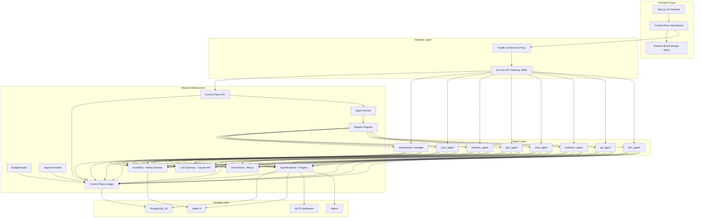

# Wisdoverse Cell Architecture

> Language note: English is the primary documentation language. This legacy document may still contain Chinese implementation details; when editing it, put the English explanation first.

> AI Native Operating Company — 2 humans + 26 AI Agents

---

## 1. System Overview

Wisdoverse Cell uses a control-plane architecture. The Frontend Workbench makes company work visible, the Gateway Layer handles external traffic, the Agent Layer hosts independently deployable services, Shared Infrastructure provides common capabilities, and the Storage Layer persists durable operating state. Each agent runs behind an explicit service boundary and collaborates through HTTP requests, adapter wakeups, and the EventBus.

中文摘要：Wisdoverse Cell 采用 Gateway、Agent、Shared Infrastructure、Storage 四层架构。每个 Agent 作为独立 FastAPI 服务运行，通过 EventBus 松耦合协作。

The product view is a control plane for company operations:

```text
Mission -> Goals -> Work Items -> Agent Runs -> Decisions -> Audit Trail
```

This control-plane layer is implemented through the existing runtime and integration boundaries: Requirement Manager turns intent into structured requirements, PJM decomposes and tracks work, Sync Agent keeps OpenProject and Feishu aligned, Chat Agent receives user interaction, Dev Agent bridges delivery workflows, QA Agent verifies outcomes, and Evolution Agent proposes improvements.



---

## 2. Control Plane Runtime

The control plane is the durable operating ledger for goals, work items, agent
roles, runs, decisions, artifacts, approvals, budgets, and audit events. It
lives under `shared/control_plane/` and is exposed through
`/api/v1/control-plane/*` when `CONTROL_PLANE_ENABLED=true`.

Key runtime pieces:

| Component | Responsibility |
|-----------|----------------|
| `shared/control_plane/models.py` | Pydantic contracts for durable control-plane objects |
| `shared/control_plane/tables.py` | SQLAlchemy tables and persistence schema |
| `shared/control_plane/repository.py` | Repository boundary for ledger reads/writes |
| `shared/control_plane/api.py` | FastAPI routes for operator and service access |
| `shared/app/plugins/control_plane.py` | Optional `ControlPlanePlugin` for `AgentRun` lifecycle evidence |
| `shared/control_plane/agent_runner.py` | Manual wakeup and heartbeat execution path |
| `shared/control_plane/adapter_registry.py` | Built-in, HTTP, and fail-closed local adapter registry |
| `shared/control_plane/approval_gate.py` | Human-in-the-loop approval creation and resolution helpers |
| `shared/control_plane/budget_guard.py` | Budget enforcement and usage evidence for LLM/tool work |

The production execution boundary for frontend-created agents is the `http`
adapter targeting a deployed `create_agent_app()` service and authenticated
`POST /agent/request`. Local process adapters are disabled unless
`CONTROL_PLANE_LOCAL_ADAPTER_ENABLED=true` and the exact adapter key is present
in `CONTROL_PLANE_LOCAL_ADAPTER_ALLOWLIST`.

Agent fleet modeling is split into two layers:

| Layer | Meaning |
|-------|---------|
| Organization role agents | CEO/CTO/CPO/COO/PM-style `AgentRole` records that own intent, tradeoffs, user interaction policy, and business decisions |
| Capability modules | Existing services such as sync, QA, requirement extraction, analysis, development execution, and evolution analysis |

Capability modules SHOULD be invoked by role agents, gateways, schedulers, or
work items. They SHOULD NOT be presented as organization roles unless they have
a direct role-level interaction contract.

---

## 3. Communication Model

Agents communicate through synchronous and asynchronous boundaries. Synchronous calls use `AgentClient` over HTTP REST (see ADR-0004) for request/response workflows. Asynchronous collaboration uses Redis Streams EventBus with consumer groups for event-driven decoupling.

中文摘要：同步调用走 `AgentClient` HTTP REST；异步协作走 Redis Streams EventBus。

Control-plane wakeups add a third boundary: the control-plane API creates an
`AgentRun`, resolves adapter policy, calls a deployed `/agent/request` endpoint
or an explicitly enabled local adapter, then appends output, error, budget,
approval, artifact, and audit evidence back to the same trace.

**Event format:**

```python
Event(
    event_id="evt_{ulid}",
    event_type="{domain}.{action}",
    source_agent="agent-id",
    payload={...},
    schema_version="1.0",
)
```

Events are immutable and fire-and-forget. Cross-agent tracing uses `trace_id`.

---

## 4. Frontend Architecture

The frontend control-plane workbench uses Feature-Sliced Design. Domain data
and API hooks live in `frontend/src/entities/`, user actions live in
`frontend/src/features/`, composed operator surfaces live in
`frontend/src/widgets/`, and route files in `frontend/src/app/` stay thin.

Current control-plane slices:

| Slice | Responsibility |
|-------|----------------|
| `entities/control-plane` | Goals, work items, runs, decisions, artifacts, approvals, budgets, audit timeline |
| `entities/agent` | Agent kind, interaction mode, context source, registry, and control-plane agent API hooks |
| `features/agent-create` | Operator-created role/module dialog with organization-role vs capability-module separation |
| `features/agent-wakeup` | Manual agent wakeup action |
| `widgets/control-plane-workbench` | `/[locale]/workflows` operator console |
| `widgets/agent-fleet` and `widgets/agent-detail` | Agent fleet and detail surfaces |

Route-level code should not own control-plane state directly; it should compose
widgets and pass only route/search parameters.

---

## 5. Hexagonal Architecture

The messaging system follows hexagonal architecture (see ADR-0005), decoupling core ports from external adapters. `shared/core/messaging/` defines port interfaces, `shared/messaging/` handles inbound/outbound orchestration, and `shared/integrations/` implements platform adapters. This layering allows platform adapters to be replaced without changing core logic.

中文摘要：消息系统将端口、编排、平台适配器分层，避免外部平台变化影响核心逻辑。

```
shared/core/messaging/   -> Port interfaces (abstract)
shared/messaging/inbound/ -> Inbound orchestration
shared/messaging/outbound/ -> Outbound orchestration
shared/integrations/feishu/ -> Feishu adapter
shared/integrations/wecom/ -> WeCom adapter
```

---

## 6. Data Isolation

Each agent has its own PostgreSQL user with minimal privileges and a dedicated Redis database number (see ADR-0002). Each agent owns its tables, and direct cross-agent data access is prohibited. This gives the system fault isolation and clear security boundaries.

中文摘要：每个 Agent 使用独立数据库权限和 Redis DB，禁止直接跨 Agent 访问数据。

---

## 7. Self-Evolution

The self-evolution system has three layers: L1 optimizes skills and prompts, L2 proposes architecture improvements, and L3 optimizes multi-agent collaboration patterns. Implementation lives in `shared/evolution/` and `agents/evolution_agent/`.

中文摘要：L1 优化 Skill/Prompt，L2 优化架构，L3 优化多 Agent 协作模式。

---

## 8. Agent Runtime Framework

`create_agent_app()` creates a standardized FastAPI application in one line, including lifecycle management and middleware. `AgentRuntime` manages agent lifecycle and plugins. `RuntimePlugin` is the extension point, following the open-closed principle. `EvolvedAgent` wraps `BaseAgent` to inject self-evolution capabilities. `ControlPlanePlugin` is opt-in and records `AgentRun` lifecycle evidence without forcing every agent to import ledger code directly.

中文摘要：`create_agent_app()` 标准化 FastAPI 入口；`AgentRuntime` 管理生命周期和插件；`EvolvedAgent` 注入自进化能力。

```python
# One-line agent creation
app = create_agent_app(agent=MyAgent(), plugins=[MyPlugin()])
```

Each `create_agent_app()` service also exposes authenticated `POST /agent/request`
for generic deployed-agent wakeups. Scheduler jobs and control-plane adapters
must call `runtime.agent` through this service boundary rather than reaching
into `_raw_agent`.

---

## 9. Deployment Topology

All services are orchestrated through Docker Compose. Traefik v3 handles routing and TLS termination. Each agent runs as an independent container or standalone `create_agent_app()` service with its own port. Infrastructure (PostgreSQL, Redis, NATS, Milvus) can be started independently with `make up-infra`.

中文摘要：Docker Compose 编排服务，Traefik 处理路由和 TLS，基础设施可单独启动。

```
Traefik :443/:80
  ├── /api/*        -> gateway :8080
  ├── /agent/rm/*   -> requirement_manager :8000
  ├── /agent/sync/* -> sync_agent :8010
  ├── /agent/pm/*   -> pjm_agent :8012
  ├── /agent/qa/*   -> qa_agent :8014
  ├── /agent/dev/*  -> dev_agent :8015
  └── ...           -> other deployed agents
```
