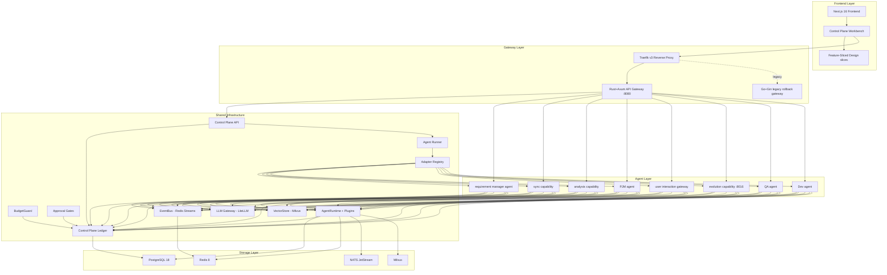

# Wisdoverse Cell Architecture

> AI Native Operating Company - 2 humans + 26 AI Agents

---

## 1. System Overview

Wisdoverse Cell uses a control-plane architecture. The Frontend Workbench makes company work visible, the Gateway Layer handles external traffic, the Agent Layer hosts independently deployable services, Shared Infrastructure provides common capabilities, and the Storage Layer persists durable operating state. Each agent runs behind an explicit service boundary and collaborates through HTTP requests, adapter wakeups, and the EventBus.

The product view is a control plane for company operations:

```text
Mission -> Goals -> Work Items -> Agent Runs -> Decisions -> Audit Trail
```

This control-plane layer is implemented through explicit runtime and integration boundaries: the requirement manager agent turns intent into structured requirements, the PJM agent decomposes and tracks work, the sync runtime hosts separate OpenProject and Feishu Bitable synchronization boundaries, the user interaction gateway receives users, the dev agent bridges delivery workflows, the QA agent verifies outcomes, and the evolution capability proposes improvements.

## Architecture Boundary Rules

Wisdoverse Cell uses Control Plane Architecture at repository level.

Backend architecture:

- Agent Service Boundary for runtime isolation
- Strategic DDD for domain vocabulary and bounded contexts
- Clean Architecture inside each agent service
- Hexagonal Architecture for integrations and messaging

Frontend architecture:

- Strict Feature-Sliced Design

Rules:

1. Agents must not directly import another independently deployed agent.
2. Agents communicate through HTTP clients or EventBus events.
3. External platforms must be accessed through ports and adapters.
4. `shared/control_plane` owns durable product objects: `Goal`, `WorkItem`, `AgentRole`, `AgentRun`, `Approval`, `Budget`, `Artifact`, `AuditEvent`.
5. `shared/core` owns abstract ports and protocols.
6. `shared/integrations` owns platform adapters.
7. `shared/utils` must not contain business logic.
8. Frontend route files must stay thin.
9. Frontend domain data belongs to `entities`.
10. Frontend user actions belong to `features`.
11. Frontend composed operator surfaces belong to `widgets`.
12. All cross-boundary contracts must be documented in `SPEC.md`, API docs, or the Event Catalog.



---

## 2. Control Plane Runtime

The control plane is the durable operating ledger for goals, work items, agent
roles, runs, decisions, artifacts, approvals, budgets, and audit events. It
lives under `shared/control_plane/` and is exposed through
`/api/v1/control-plane/*` when `CONTROL_PLANE_ENABLED=true`.

Key runtime pieces:

| Component | Responsibility |
|-----------|----------------|
| `shared/control_plane/models.py` | Pydantic contracts for durable control-plane objects |
| `shared/control_plane/tables.py` | SQLAlchemy tables and persistence schema |
| `shared/control_plane/repository.py` | Repository boundary for ledger reads/writes |
| `shared/control_plane/api.py` | FastAPI routes for operator and service access |
| `shared/app/plugins/control_plane.py` | Optional `ControlPlanePlugin` for `AgentRun` lifecycle evidence |
| `shared/control_plane/agent_runner.py` | Manual wakeup and heartbeat execution path |
| `shared/control_plane/adapter_registry.py` | Built-in, HTTP, and fail-closed local adapter registry |
| `shared/control_plane/approval_gate.py` | Human-in-the-loop approval creation and resolution helpers |
| `shared/control_plane/budget_guard.py` | Budget enforcement and usage evidence for LLM/tool work |

The backend default is Rust + Python. Rust owns the edge gateway under
`rust/gateway/`, while Python owns the agent runtime, control-plane ledger, LLM
orchestration, and support capability modules. The legacy Go gateway remains
under `gateway/` only for explicit rollback drills until operational evidence
no longer requires it. Rust gateway service clients are generated from the same
protobuf contracts that Python services implement; for example, `/ready` calls
the requirement manager `HealthCheck` RPC through the shared
`requirement.proto` boundary.

The production execution boundary for frontend-created agents is the `http`
adapter targeting a deployed `create_agent_app()` service and authenticated
`POST /agent/request`. Local process adapters are disabled unless
`CONTROL_PLANE_LOCAL_ADAPTER_ENABLED=true` and the exact adapter key is present
in `CONTROL_PLANE_LOCAL_ADAPTER_ALLOWLIST`.

Agent fleet modeling is split into two layers:

| Layer | Meaning |
|-------|---------|
| Organization role agents | CEO/CTO/CPO/COO/PM-style `AgentRole` records that own intent, tradeoffs, user interaction policy, and business decisions |
| Root business runtime agents | `requirement-manager`, `pjm-agent`, `qa-agent`, and `dev-agent`; these live directly under `agents/` and own business work outcomes |
| Support capability modules | Existing services such as sync, analysis, and evolution analysis |

Support capability modules SHOULD be invoked by role agents, root business
agents, gateways, schedulers, or work items. They SHOULD NOT be presented as
organization roles unless they have a direct role-level interaction contract.

---

## 3. Communication Model

Agents communicate through synchronous and asynchronous boundaries. Synchronous calls use `AgentClient` over HTTP REST (see ADR-0004) for request/response workflows. Asynchronous collaboration uses Redis Streams EventBus with consumer groups for event-driven decoupling.
Redis EventBus exposes pending counts plus a `dlq.failed` stream for handler
failures and malformed messages. Consumers must remain idempotent because
delivery is at least once; handlers should use stable `event_id` or a
domain-level idempotency key when mutating durable state.

Control-plane wakeups add a third boundary: the control-plane API creates an
`AgentRun`, resolves adapter policy, calls a deployed `/agent/request` endpoint
or an explicitly enabled local adapter, then appends output, error, budget,
approval, artifact, and audit evidence back to the same trace.

**Event format:**

```python
Event(
    event_id="evt_{ulid}",
    event_type="{domain}.{action}",
    source_agent="agent-id",
    payload={...},
    schema_version="1.0",
)
```

Events are immutable and fire-and-forget. Cross-agent tracing uses `trace_id`.

---

## 4. Frontend Architecture

The frontend control-plane workbench uses Feature-Sliced Design. Domain data
and API hooks live in `frontend/src/entities/`, user actions live in
`frontend/src/features/`, composed operator surfaces live in
`frontend/src/widgets/`, and route files in `frontend/src/app/` stay thin.

Current control-plane slices:

| Slice | Responsibility |
|-------|----------------|
| `entities/control-plane` | Goals, work items, runs, decisions, artifacts, approvals, budgets, evolution proposals, audit timeline |
| `entities/agent` | Agent kind, interaction mode, context source, registry, and control-plane agent API hooks |
| `entities/activity`, `entities/approval`, `entities/question`, `entities/requirement`, `entities/usage` | Domain fixtures, filters, and API hooks for operator surfaces |
| `features/agent-create` | Operator-created role/module dialog with organization-role vs capability-module separation |
| `features/agent-wakeup` | Manual agent wakeup action |
| `widgets/control-plane-workbench` | `/[locale]/workflows` operator console, including evolution proposal visibility |
| `widgets/agent-fleet`, `widgets/agent-detail`, `widgets/requirements`, and other page widgets | Composed operator surfaces used by thin route files |

Route-level code should not own control-plane state directly; it should compose
widgets and pass only route/search parameters.

---

## 5. Hexagonal Architecture

The messaging system follows hexagonal architecture (see ADR-0005), decoupling core ports from external adapters. `shared/core/messaging/` defines messaging port interfaces, `shared/core/channels/` defines channel message/card abstractions, `shared/core/ids.py` defines stable runtime and control-plane ID contracts, `shared/core/integration_ports.py` defines external platform ports for OpenProject, Feishu Bitable, Feishu messaging, Feishu contact lookup, Feishu webhooks, GitLab MR creation, and GitLab MR notes, `shared/messaging/` handles inbound/outbound orchestration, and `shared/integrations/` implements platform adapters. This layering allows platform adapters to be replaced without changing core logic.

Inside a root business agent, service-specific external clients live under the
agent's own `adapters/` package. The agent `core/` package owns business and
application logic and should depend on ports or injected collaborators rather
than constructing HTTP clients directly.

```
shared/core/messaging/   -> Port interfaces (abstract)
shared/core/channels/    -> Channel message/card abstractions
shared/core/ids.py       -> Stable runtime and control-plane ID contracts
shared/core/integration_ports.py -> External platform ports (abstract)
shared/messaging/inbound/ -> Inbound orchestration
shared/messaging/outbound/ -> Outbound orchestration
shared/integrations/feishu/ -> Feishu adapter, including shared Feishu card renderers
shared/integrations/wecom/ -> WeCom adapter
agents/<agent>/adapters/ -> Agent-local external adapters
```

Feishu interactive-card payload construction is a shared platform integration
capability. Agent cores should expose business-level card-rendering ports, while
service entry points inject concrete renderers from
`shared/integrations/feishu/cards/`.

---

## 6. Data Isolation

Each agent has its own PostgreSQL user with minimal privileges and a dedicated Redis database number (see ADR-0002). Each agent owns its tables, and direct cross-agent data access is prohibited. This gives the system fault isolation and clear security boundaries.

---

## 7. Self-Evolution

The self-evolution system has three layers: L1 optimizes skills and prompts, L2 proposes architecture improvements, and L3 optimizes multi-agent collaboration patterns. Implementation lives in `shared/evolution/` and `shared/capabilities/evolution/`.

---

## 8. Agent Runtime Framework

`create_agent_app()` creates a standardized FastAPI application in one line, including lifecycle management and middleware. `AgentRuntime` manages agent lifecycle and plugins. `RuntimePlugin` is the extension point, following the open-closed principle. `EvolvedAgent` wraps `BaseAgent` to inject self-evolution capabilities. `ControlPlanePlugin` is opt-in and records `AgentRun` lifecycle evidence without forcing every agent to import ledger code directly.

The shared `LLMGateway` is the only supported model access boundary for agent
code. It routes all model calls through LiteLLM. Agents must not instantiate
provider SDK clients directly; retries, budgets, circuit breaking, provider
routing, and usage evidence stay inside the gateway.

```python
# One-line agent creation
app = create_agent_app(agent=MyAgent(), plugins=[MyPlugin()])
```

Each `create_agent_app()` service also exposes authenticated `POST /agent/request`
for generic deployed-agent wakeups. Scheduler jobs and control-plane adapters
must call `runtime.agent` through this service boundary rather than reaching
into `_raw_agent`.

---

## 9. Deployment Topology

All services are orchestrated through Docker Compose. Traefik v3 handles routing and TLS termination. Each agent runs as an independent container or standalone `create_agent_app()` service with its own port. Infrastructure (PostgreSQL, Redis, NATS, Milvus) can be started independently with `make up-infra`.

```
Traefik :443/:80
  ├── /api/*        -> gateway :8080
  ├── /agent/rm/*   -> requirement manager agent :8000
  ├── /agent/sync/* -> sync capability :8010
  ├── /agent/analysis/* -> analysis capability :8011
  ├── /agent/pm/*   -> PJM agent :8012
  ├── /agent/chat/* -> user interaction gateway :8013
  ├── /agent/qa/*   -> QA agent :8014
  ├── /agent/dev/*  -> Dev agent :8015
  ├── /agent/evolution/* -> evolution capability :8016
  └── ...           -> other deployed agents
```
