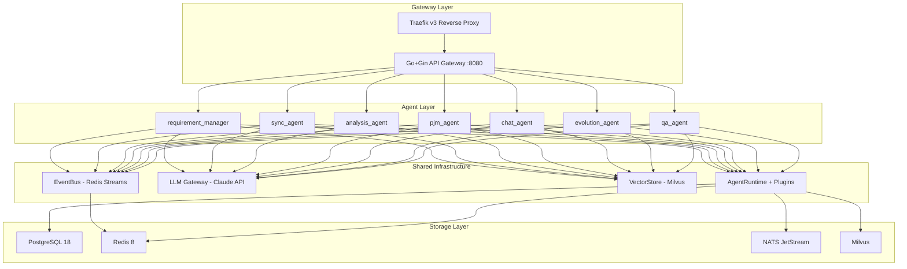

# Wisdoverse Cell Architecture

> Language note: English is the primary documentation language. This legacy document may still contain Chinese implementation details; when editing it, put the English explanation first.

> AI Native Operating Company — 2 humans + 26 AI Agents

---

## 1. System Overview

Wisdoverse Cell uses a four-layer architecture: the Gateway Layer handles external traffic, the Agent Layer hosts business logic, Shared Infrastructure provides common capabilities (EventBus, LLM Gateway, VectorStore, plugin-based runtime), and the Storage Layer persists state. Each agent runs as an independent FastAPI service and collaborates through the EventBus.

中文摘要：Wisdoverse Cell 采用 Gateway、Agent、Shared Infrastructure、Storage 四层架构。每个 Agent 作为独立 FastAPI 服务运行，通过 EventBus 松耦合协作。

The product view is a control plane for company operations:

```text
Mission -> Goals -> Work Items -> Agent Runs -> Decisions -> Audit Trail
```

This control-plane layer is implemented through the existing runtime and integration boundaries: Requirement Manager turns intent into structured requirements, PJM decomposes and tracks work, Sync Agent keeps OpenProject and Feishu aligned, Chat Agent receives user interaction, QA Agent verifies outcomes, and Evolution Agent proposes improvements.



---

## 2. Communication Model

Agents communicate through synchronous and asynchronous boundaries. Synchronous calls use `AgentClient` over HTTP REST (see ADR-0004) for request/response workflows. Asynchronous collaboration uses Redis Streams EventBus with consumer groups for event-driven decoupling.

中文摘要：同步调用走 `AgentClient` HTTP REST；异步协作走 Redis Streams EventBus。

**Event format:**

```python
Event(
    event_id="evt_{ulid}",
    event_type="{domain}.{action}",
    source_agent="agent-id",
    payload={...},
    schema_version="1.0",
)
```

Events are immutable and fire-and-forget. Cross-agent tracing uses `trace_id`.

---

## 3. Hexagonal Architecture

The messaging system follows hexagonal architecture (see ADR-0005), decoupling core ports from external adapters. `shared/core/messaging/` defines port interfaces, `shared/messaging/` handles inbound/outbound orchestration, and `shared/integrations/` implements platform adapters. This layering allows platform adapters to be replaced without changing core logic.

中文摘要：消息系统将端口、编排、平台适配器分层，避免外部平台变化影响核心逻辑。

```
shared/core/messaging/   -> Port interfaces (abstract)
shared/messaging/inbound/ -> Inbound orchestration
shared/messaging/outbound/ -> Outbound orchestration
shared/integrations/feishu/ -> Feishu adapter
shared/integrations/wecom/ -> WeCom adapter
```

---

## 4. Data Isolation

Each agent has its own PostgreSQL user with minimal privileges and a dedicated Redis database number (see ADR-0002). Each agent owns its tables, and direct cross-agent data access is prohibited. This gives the system fault isolation and clear security boundaries.

中文摘要：每个 Agent 使用独立数据库权限和 Redis DB，禁止直接跨 Agent 访问数据。

---

## 5. Self-Evolution

The self-evolution system has three layers: L1 optimizes skills and prompts, L2 proposes architecture improvements, and L3 optimizes multi-agent collaboration patterns. Implementation lives in `shared/evolution/` and `agents/evolution_agent/`.

中文摘要：L1 优化 Skill/Prompt，L2 优化架构，L3 优化多 Agent 协作模式。

---

## 6. Agent Runtime Framework

`create_agent_app()` creates a standardized FastAPI application in one line, including lifecycle management and middleware. `AgentRuntime` manages agent lifecycle and plugins. `RuntimePlugin` is the extension point, following the open-closed principle. `EvolvedAgent` wraps `BaseAgent` to inject self-evolution capabilities.

中文摘要：`create_agent_app()` 标准化 FastAPI 入口；`AgentRuntime` 管理生命周期和插件；`EvolvedAgent` 注入自进化能力。

```python
# One-line agent creation
app = create_agent_app(agent=MyAgent(), plugins=[MyPlugin()])
```

---

## 7. Deployment Topology

All services are orchestrated through Docker Compose. Traefik v3 handles routing and TLS termination. Each agent runs as an independent container with its own port. Infrastructure (PostgreSQL, Redis, NATS, Milvus) can be started independently with `make up-infra`.

中文摘要：Docker Compose 编排服务，Traefik 处理路由和 TLS，基础设施可单独启动。

```
Traefik :443/:80
  ├── /api/*        -> gateway :8080
  ├── /agent/rm/*   -> requirement_manager :8001
  ├── /agent/sync/* -> sync_agent :8002
  ├── /agent/pm/*   -> pjm_agent :8003
  └── ...           -> other agents :800x
```
