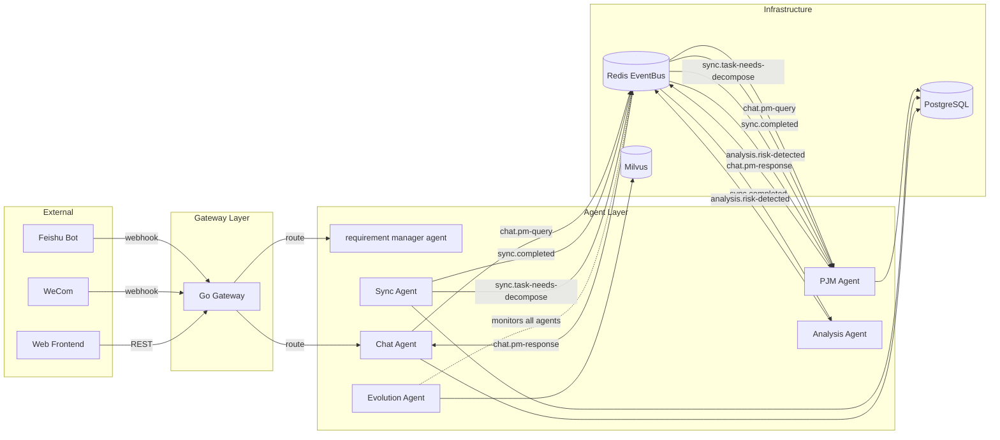
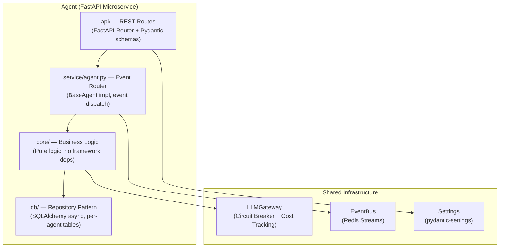
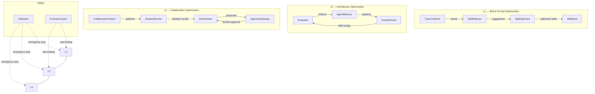

# Wisdoverse Cell Developer Onboarding Guide

> **Version**: v2026.03 | **Audience**: New developers joining Wisdoverse Cell | **Maintainer**: Platform Team

---

## Table of Contents

1. [First 30 Minutes — Clone, Setup, Verify](#1-first-30-minutes)
2. [First Day — Understand the Architecture](#2-first-day)
3. [First Week — Make Your First Contribution](#3-first-week)
4. [Architecture Mental Model](#4-architecture-mental-model)
5. [Key Principles — 10 Rules Every Developer Must Know](#5-key-principles)
6. [IDE Setup](#6-ide-setup)
7. [Common Pitfalls](#7-common-pitfalls)

---

## 1. First 30 Minutes

Goal: get the project running on your machine and verify all health endpoints respond.

### 1.1 Clone and Setup

```bash
# Clone the repository
git clone https://github.com/Wisdoverse/Wisdoverse-Cell.git
cd Wisdoverse-Cell

# Create virtual environment and install dependencies
python -m venv .venv
source .venv/bin/activate
pip install -r requirements.txt

# Copy environment template and fill in required values
cp .env.example .env
# Edit .env — set POSTGRES_PASSWORD, AUTH_SECRET, and provider keys for the selected LiteLLM models
```

### 1.2 Start Infrastructure

```bash
# Start PostgreSQL, PgBouncer, Redis, NATS, Milvus
make up-infra
```

Wait for all containers to report healthy:

```bash
make ps
```

### 1.3 Run Tests

```bash
make test
```

All tests should pass. If any fail, check that infrastructure containers are healthy and `.env` is properly configured.

### 1.4 Verify Health Endpoints

```bash
# Start one agent locally (e.g., requirement-manager)
make dev

# In another terminal, verify health
curl -f http://localhost:8000/health
# Expected: {"status": "alive", "agent": "requirement-manager"}

curl -f http://localhost:8000/health/ready
# Expected: {"status": "ready", ...}
```

If both respond successfully, your environment is ready.

---

## 2. First Day

Goal: understand the architecture, read the key documents, and run each agent locally.

### 2.1 Required Reading (in order)

| Order | Document | Why |
|:-----:|----------|-----|
| 1 | [`AGENTS.md`](../../AGENTS.md) | Supreme law of the repo — architecture boundaries, coding standards, workflow, and operational commands |
| 2 | [`docs/INDEX.md`](../INDEX.md) | Navigation hub for all documentation — ADRs, PRDs, design docs |
| 3 | [`docs/guides/event-catalog.md`](../guides/event-catalog.md) | All 46+ event types, payload schemas, producer/consumer matrix |
| 4 | [`docs/guides/agent-development.md`](../guides/agent-development.md) | How to build an Agent — BaseAgent, create_agent_app, plugins, tests |

### 2.2 Key Concept: Control Plane and Agent Service Boundaries

Wisdoverse Cell is a control plane for AI-native company operations. Real
business runtime agents are independently deployed FastAPI services under
`agents/`; support capabilities and gateways live outside that tree.

Each deployed agent service:

1. Subscribes to events through Redis Streams or NATS-compatible EventBus ports.
2. Processes business logic through its own service boundary.
3. Calls models only through `shared.infra.llm_gateway.LLMGateway`, which uses
   LiteLLM as the provider boundary.
4. Publishes new events or returns HTTP responses through documented contracts.

Agents never import another independently deployed agent's internal Python code.
Communication is either:

- Async: EventBus events.
- Sync: HTTP via typed clients or `AgentClient`.

### 2.3 Key Concept: BaseAgent, EvolvedAgent, and create_agent_app

The Agent lifecycle is layered:

```
BaseAgent (you write this)
    └── EvolvedAgent (auto-wrapped by EvolutionPlugin — adds L1/L2/L3 self-evolution tracking)
        └── AgentRuntime (manages lifecycle, plugins, health checks)
            └── create_agent_app() (factory — produces a production-ready FastAPI app)
```

- **BaseAgent**: Abstract base class. You implement `handle_event()`, `handle_request()`, `startup()`, `shutdown()`.
- **EvolvedAgent**: Automatically wraps your agent to track performance, enable skill optimization, and participate in the evolution system. You do not create this manually.
- **create_agent_app()**: One-line factory that gives you health endpoints, middleware stack, Prometheus metrics, OpenTelemetry tracing, and evolution wrapping. Always use this — never hand-roll lifespan or middleware.

### 2.4 Run Each Agent Locally

```bash
# Requirement manager agent (default for `make dev`)
make dev                                                      # port 8000

# Sync support capability
uvicorn shared.capabilities.sync.app.main:app --reload --port 8010

# Analysis support capability
uvicorn shared.capabilities.analysis.app.main:app --reload --port 8011

# PJM Agent
uvicorn agents.pjm_agent.app.main:app --reload --port 8012

# User interaction gateway
uvicorn services.gateways.user_interaction.app.main:app --reload --port 8013

# QA Agent
uvicorn agents.qa_agent.app.main:app --reload --port 8014

# Dev Agent
uvicorn agents.dev_agent.app.main:app --reload --port 8015

# Evolution support capability (standalone; choose a free local port)
uvicorn shared.capabilities.evolution.app.main:app --reload --port 8016
```

For each agent, verify:

```bash
curl http://localhost:<port>/health
curl http://localhost:<port>/health/ready
```

### 2.5 Send a Test Event

Use the EventBus directly to publish a test event and watch an agent react:

```python
# In a Python shell with the venv active
import asyncio
from shared.infra.event_bus import event_bus
from shared.schemas.event import Event

async def send_test():
    await event_bus.connect()
    event = Event(
        event_type="sync.completed",
        source_agent="test-harness",
        payload={"test": True},
    )
    await event_bus.publish(event)
    await event_bus.disconnect()

asyncio.run(send_test())
```

Watch the pjm-agent or analysis-agent logs to see the event processed.

---

## 3. First Week

Goal: make your first contribution — add a tool to the user interaction gateway
or create a minimal new agent service.

### 3.1 Tutorial: Add a New Tool to the User Interaction Gateway

The user interaction gateway uses LiteLLM-mediated tool calling. To add a new
tool:

**Step 1**: Define the tool schema.

```python
# services/gateways/user_interaction/core/tools/my_tool.py
from shared.utils.logger import get_logger

logger = get_logger("chat_agent.tools.my_tool")

MY_TOOL_SCHEMA = {
    "name": "my_tool",
    "description": "Does something useful",
    "input_schema": {
        "type": "object",
        "properties": {
            "query": {"type": "string", "description": "The user query"},
        },
        "required": ["query"],
    },
}

async def handle_my_tool(params: dict) -> str:
    """Execute the tool and return a string result."""
    query = params["query"]
    logger.info("my_tool_called", query=query)
    # Your logic here
    return f"Result for: {query}"
```

**Step 2**: Register the tool in the Chat Agent's tool registry.

**Step 3**: Write tests.

```python
# services/gateways/user_interaction/tests/test_my_tool.py
import pytest
from services.gateways.user_interaction.core.tools.my_tool import handle_my_tool

@pytest.mark.asyncio
async def test_my_tool_returns_result():
    result = await handle_my_tool({"query": "test"})
    assert "test" in result
```

**Step 4**: Verify and submit.

```bash
make test
ruff check services/gateways/user_interaction/
# Create MR from feature branch
```

### 3.2 Tutorial: Create a Minimal New Agent Using create_agent_app

**Step 1**: Create the directory structure.

```
shared/capabilities/hello_capability/
├── __init__.py
├── app/
│   ├── __init__.py
│   └── main.py
├── service/
│   ├── __init__.py
│   └── agent.py
└── tests/
    ├── __init__.py
    └── test_agent.py
```

**Step 2**: Implement the agent (`shared/capabilities/hello_capability/service/agent.py`).

```python
from shared.schemas.agent import BaseAgent
from shared.schemas.event import Event
from shared.utils.logger import get_logger

logger = get_logger("hello_agent.service")


class HelloAgent(BaseAgent):
    def __init__(self):
        super().__init__(
            agent_id="hello-agent",        # kebab-case!
            agent_name="Hello Agent",
            subscribed_events=["sync.completed"],
            published_events=["hello.greeted"],
        )

    async def handle_event(self, event: Event) -> list[Event]:
        logger.info("received_event", event_type=event.event_type)
        return [
            self.create_event(
                event_type="hello.greeted",
                payload={"message": "Hello from Hello Agent!"},
                trace_id=event.metadata.trace_id,
            )
        ]

    async def handle_request(self, request: dict) -> dict:
        return {"status": "ok", "agent": self.agent_id}


agent = HelloAgent()
```

**Step 3**: Create the FastAPI app (`shared/capabilities/hello_capability/app/main.py`).

```python
from shared.app import create_agent_app
from ..service.agent import agent as _raw_agent

app = create_agent_app(
    _raw_agent,
    title="Hello Agent",
    description="Minimal example agent",
)
```

That is it. `create_agent_app` provides `/health`, `/health/ready`, middleware, metrics, and evolution wrapping automatically.

**Step 4**: Write tests (`shared/capabilities/hello_capability/tests/test_agent.py`).

```python
from shared.schemas.agent import BaseAgent
from shared.capabilities.hello_capability.service.agent import HelloAgent


class TestHelloAgent:
    def test_inherits_base_agent(self):
        agent = HelloAgent()
        assert isinstance(agent, BaseAgent)

    def test_agent_id_is_kebab_case(self):
        agent = HelloAgent()
        assert agent.agent_id == "hello-agent"

    def test_subscribed_events(self):
        agent = HelloAgent()
        assert "sync.completed" in agent.subscribed_events

    def test_create_event_sets_source(self):
        agent = HelloAgent()
        event = agent.create_event(
            event_type="hello.greeted",
            payload={"message": "hi"},
        )
        assert event.source_agent == "hello-agent"
        assert event.event_id.startswith("evt_")
```

**Step 5**: Run, lint, create MR.

```bash
# Run tests
.venv/bin/python -m pytest shared/capabilities/hello_capability/tests/ -v

# Lint
ruff check shared/capabilities/hello_capability/

# Create feature branch and MR
git checkout -b feat/hello-agent
git add shared/capabilities/hello_capability/
git commit -m "feat: add hello-agent minimal example"
git push -u origin feat/hello-agent
```

---

## 4. Architecture Mental Model

### 4.1 Event Flow Between Agents



### 4.2 Agent Internal Layers



### 4.3 Evolution System (L1 / L2 / L3)



---

## 5. Key Principles

**10 rules every developer must know.** Violating these will fail code review.

### Rule 1: Agent IDs Use kebab-case

```python
# Correct
agent_id = "my-agent"

# Wrong
agent_id = "my_agent"
agent_id = "MyAgent"
```

### Rule 2: Use `datetime.now(UTC)` Not `utcnow()`

```python
from datetime import UTC, datetime

# Correct
now = datetime.now(UTC)

# Wrong — deprecated in Python 3.12+
now = datetime.utcnow()
```

### Rule 3: Never Import Provider SDKs Directly

All LLM calls go through `LLMGateway`, which provides circuit breaking, cost tracking, and retry logic.

```python
# Correct
from shared.infra.llm_gateway import llm_gateway
result = await llm_gateway.chat(messages=messages, model=model)

# Wrong — bypasses cost tracking and circuit breaker
from openai import AsyncOpenAI
client = AsyncOpenAI()
```

### Rule 4: Use `create_agent_app()` Not Manual Lifespan

```python
# Correct
from shared.app import create_agent_app
app = create_agent_app(agent, title="My Agent", routers=[(router, [deps])])

# Wrong — missing middleware, health endpoints, evolution, metrics
app = FastAPI()
```

### Rule 5: Scheduler Jobs Call `runtime.agent` Not `_raw_agent`

```python
# Correct — goes through EvolvedAgent wrapping
await app.state.runtime.agent.handle_request({"action": "my_action"})

# Wrong — bypasses evolution tracking
await _raw_agent.handle_request({"action": "my_action"})
```

### Rule 6: Pydantic v2 Only

```python
# Correct
model_config = ConfigDict(env_file=".env")
data = my_model.model_dump_json()
obj = MyModel.model_validate_json(raw)

# Wrong — Pydantic v1 patterns
class Config:
    env_file = ".env"
data = my_model.json()
obj = MyModel.parse_raw(raw)
```

### Rule 7: Event Types Follow `{domain}.{action}` Format

```python
# Correct
event_type = "requirement.confirmed"
event_type = "analysis.risk-detected"

# Wrong
event_type = "RequirementConfirmed"
event_type = "requirement_confirmed"
```

### Rule 8: Use Canonical Import Paths

```python
# Correct
from shared.integrations.feishu import FeishuClient
from shared.messaging.outbound.delivery_service import DeliveryService
from shared.infra.agent_client import AgentClient

# Wrong — deprecated paths blocked by CI
from shared.services.feishu import FeishuClient
```

### Rule 9: Never Log Secrets

```python
# Correct
logger.info("api_key_loaded", key_prefix=key[:8])

# Wrong — exposes full API key in logs
logger.info("api_key_loaded", key=api_key)
```

### Rule 10: Create Feature Branch Before Any Changes

```bash
# Correct
git checkout -b feat/my-feature
# ... make changes ...
git commit

# Wrong — never commit directly to main
git checkout main
# ... make changes ...
git commit  # DO NOT DO THIS
```

---

## 6. IDE Setup

### 6.1 VSCode Extensions

Install these extensions for the best development experience:

| Extension | ID | Purpose |
|-----------|-----|---------|
| Python | `ms-python.python` | Python language support |
| Pylance | `ms-python.vscode-pylance` | Type checking, IntelliSense |
| Ruff | `charliermarsh.ruff` | Linting and formatting (replaces flake8/black) |
| Even Better TOML | `tamasfe.even-better-toml` | `pyproject.toml` editing |
| Docker | `ms-azuretools.vscode-docker` | Docker/Compose support |
| GitLens | `eamodio.gitlens` | Git blame, history |
| REST Client | `humao.rest-client` | Test API endpoints in-editor |

### 6.2 VSCode Settings

Create `.vscode/settings.json` (gitignored):

```json
{
    "python.defaultInterpreterPath": ".venv/bin/python",
    "python.analysis.typeCheckingMode": "basic",
    "python.analysis.autoImportCompletions": true,
    "[python]": {
        "editor.formatOnSave": true,
        "editor.defaultFormatter": "charliermarsh.ruff",
        "editor.codeActionsOnSave": {
            "source.fixAll.ruff": "explicit",
            "source.organizeImports.ruff": "explicit"
        }
    },
    "ruff.configuration": "pyproject.toml"
}
```

### 6.3 Debug Configuration

Create `.vscode/launch.json` (gitignored):

```json
{
    "version": "0.2.0",
    "configurations": [
        {
            "name": "Debug: Requirement manager agent",
            "type": "debugpy",
            "request": "launch",
            "module": "uvicorn",
            "args": [
                "agents.requirement_manager.app.main:app",
                "--reload",
                "--port", "8000"
            ],
            "envFile": "${workspaceFolder}/.env",
            "cwd": "${workspaceFolder}"
        },
        {
            "name": "Debug: PJM Agent",
            "type": "debugpy",
            "request": "launch",
            "module": "uvicorn",
            "args": [
                "agents.pjm_agent.app.main:app",
                "--reload",
                "--port", "8012"
            ],
            "envFile": "${workspaceFolder}/.env",
            "cwd": "${workspaceFolder}"
        },
        {
            "name": "Debug: Chat Agent",
            "type": "debugpy",
            "request": "launch",
            "module": "uvicorn",
            "args": [
                "services.gateways.user_interaction.app.main:app",
                "--reload",
                "--port", "8013"
            ],
            "envFile": "${workspaceFolder}/.env",
            "cwd": "${workspaceFolder}"
        },
        {
            "name": "Debug: Current Test File",
            "type": "debugpy",
            "request": "launch",
            "module": "pytest",
            "args": ["${file}", "-v", "-s"],
            "envFile": "${workspaceFolder}/.env",
            "cwd": "${workspaceFolder}"
        }
    ]
}
```

### 6.4 Ruff Configuration

Ruff is configured in `pyproject.toml`. Run manually:

```bash
# Check lint issues
ruff check agents/ shared/

# Auto-fix safe issues
ruff check agents/ shared/ --fix

# Format code
ruff format agents/ shared/
```

---

## 7. Common Pitfalls

### Pitfall 1: Blocking the Event Loop

**Symptom**: Agent becomes unresponsive, health checks timeout.

**Cause**: Calling synchronous I/O (file read, HTTP request, DB query) without `await`.

**Fix**: Always use async libraries — `httpx` (not `requests`), `asyncpg`/`SQLAlchemy async` (not synchronous drivers), `aiofiles` (not `open()`).

```python
# Wrong — blocks the event loop
import requests
resp = requests.get("http://other-agent:8012/api/v1/status")

# Correct — non-blocking
import httpx
async with httpx.AsyncClient() as client:
    resp = await client.get("http://other-agent:8012/api/v1/status")
```

### Pitfall 2: Forgetting to Propagate `trace_id`

**Symptom**: Events from a single business flow cannot be correlated in logs or traces.

**Cause**: Creating new events without passing through the original `trace_id`.

**Fix**: Always pass `trace_id` from the incoming event:

```python
# Correct
return [self.create_event(
    event_type="my.event",
    payload=result,
    trace_id=event.metadata.trace_id,  # Propagate!
)]
```

### Pitfall 3: Using `patch("string.path")` in Tests

**Symptom**: Tests break when modules are moved or renamed.

**Cause**: String-based mock patching is brittle across directory restructuring.

**Fix**: Use `patch.object()` with the actual module reference:

```python
# Wrong — breaks if module moves
with patch("shared.infra.llm_gateway.llm_gateway.chat"):
    ...

# Correct — resilient to directory moves
import shared.infra.llm_gateway as llm_mod
with patch.object(llm_mod.llm_gateway, "chat"):
    ...
```

### Pitfall 4: Adding Imports from `shared.services.*` Deprecated Paths

**Symptom**: CI pipeline fails with `lint_deprecated_imports.py` error.

**Cause**: The codebase is migrating away from `shared.services.*` to canonical paths under `shared.integrations.*`, `shared.messaging.*`, and `shared.infra.*`.

**Fix**: Use the canonical paths:

| Old (deprecated) | New (canonical) |
|-------------------|-----------------|
| `shared.services.feishu` | `shared.integrations.feishu` |
| `shared.services.event_bus` | `shared.infra.event_bus` |
| `shared.services.llm_gateway` | `shared.infra.llm_gateway` |
| `shared.services.channel_gateway` | `shared.messaging.outbound` / `shared.messaging.inbound` |
| `shared.services.agent_client` | `shared.infra.agent_client` |

### Pitfall 5: Not Handling LLM Failures

**Symptom**: Agent crashes or returns 500 when the LiteLLM proxy or active provider is down or rate-limited.

**Cause**: Missing try/except around `llm_gateway.chat()` calls.

**Fix**: Every LLM call must have a graceful fallback. This is the CPO's key question: _"Graceful fallback if LLM fails?"_

```python
try:
    result = await llm_gateway.chat(messages=messages, model=model)
except CircuitBreakerError:
    logger.warning("llm_circuit_open, using fallback")
    result = self._fallback_result()
except Exception as e:
    logger.error("llm_call_failed", error=str(e))
    result = self._fallback_result()
```

---

> **Next steps**: Once you are comfortable, read the [API Reference](../guides/api-reference.md) for the full endpoint catalog, and the [Operations Manual](../guides/operations.md) for production deployment and monitoring.
>
> **Questions?** Ask in the Feishu development group, or consult the [Glossary](./glossary.md) for unfamiliar terms.
