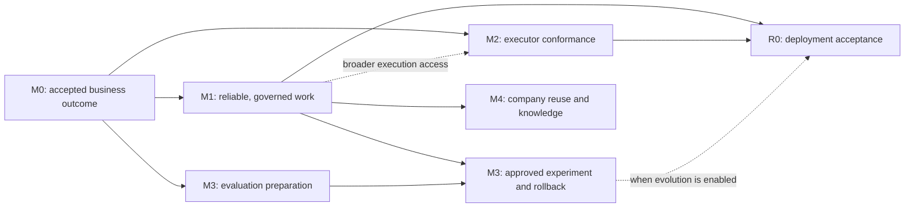

# Wisdoverse Cell Product Roadmap

Last updated: 2026-10-01

Status: Active product delivery plan. Milestones below are planned acceptance
work; existing components are identified separately. Owners and release dates
are assigned through delivery issues, not inferred here.

## Goal and Scope

Wisdoverse Cell is a self-hosted control plane for AI-native company
operations. A small human board sets direction, budgets and sensitive
decisions; agent roles turn that intent into durable, verifiable business
outcomes. The operating loop is:

```text
Goal → Work item → Accountable role → Execution → QA / required approval
     → Accepted artifact → Outcome and cost evidence → Governed improvement
```

This plan follows [SPEC goals and non-goals](../../SPEC.md#2-goals-and-non-goals)
and the [Product Model](./product-model.md). Delivery is measured by accepted
outcomes, recoverability and cost within policy. The number of agents,
services or frameworks is not a success metric. Finance, legal, customer and
sensitive technical actions retain human approval requirements.

The [Public Project Landscape](./public-project-landscape.md) records eight
reviewed projects and fixed source revisions. Paperclip is the closest
company-control-plane comparison; the other projects inform role handoffs,
executor boundaries and durable execution. Their documented features are
design inputs, not independently benchmarked results.

## Verified Baseline and Open Acceptance

Reviewed main: `c387877` (2026-10-01). [PR #393](https://github.com/Wisdoverse/Wisdoverse-Cell/pull/393)
merged a tree identical to tested head `0be83da`: all six
[CI jobs](https://github.com/Wisdoverse/Wisdoverse-Cell/actions/runs/36824604748)
and four [CodeQL jobs](https://github.com/Wisdoverse/Wisdoverse-Cell/actions/runs/36824604759)
passed, including dependency audits, public hygiene, migration round trip and
image builds. This establishes a tested engineering baseline, not production
readiness or repository-wide type/test coverage. Python audit uses the
repository's existing explicit advisory policy.

| Area | Implemented foundation | Acceptance still needed |
|------|------------------------|-------------------------|
| Company operating model | Goals, roles, work items, runs, approvals, budgets, artifacts and audit records; one synthetic PostgreSQL-backed browser flow persists linked outcome evidence; [operator surfaces](./product-model.md#current-operator-surfaces) | Native Requirement Manager→PJM→Dev→QA business delivery and live business acceptance remain open |
| Execution | [Registry](../../shared/control_plane/adapter_registry.py) and [runner](../../shared/control_plane/agent_runner.py): HTTP execution and gated local process paths; the native receiver adds owner-local durable receipts for four runtimes | Synthetic native-handler conformance and PostgreSQL replay/concurrency are verified; live provider/platform conformance and safe lifecycle acceptance remain open. `builtin` recording alone does not deliver a task. |
| Scheduling and recovery | Due-once [heartbeat scheduler](../../shared/control_plane/scheduler.py), per-runtime outboxes and selected deduplication paths | Production scheduler ownership, atomic claims/leases, safe restart and replay across the selected work path |
| Governance | Approval commands/gates, budget policies/usage, internal authentication and local-adapter restrictions | Enforced operator/tool scopes, approval-to-action binding and concurrent budget behavior on every supported execution path |
| Self-evolution | Proposal/rollout ledger plus evaluator, skill canary/rollback and collaboration shadow components | Integrated, measured proposal-to-experiment-to-rollback flow |
| Architecture | [DDD audit](../architecture/ddd-compliance-audit.md#2-executive-summary) records 22/22 code-level remediation closures | Runtime-specific migration cutover and deployment acceptance |
| Portability | Compose and environment templates | Safe company-template export/import; organizational knowledge lifecycle |

## Engineering Delivery Snapshot (2026-10-01)

This snapshot describes implemented repository surfaces, not completed
milestones. The [engineering receipt](../evidence/product-roadmap-engineering-2026-10-01.md)
maps implementation sources and records completed local validation and open milestone acceptance.
The [product governance runbook](../runbooks/product-governance.md) and
[Control Plane metrics runbook](../runbooks/control-plane-metrics.md) describe
operator policy and metrics operations.

| Area | Implemented foundation as of this snapshot | Acceptance remains open |
|------|--------------------------------------------|-------------------------|
| M0 — report and first outcome | First-success CLI creates a synthetic report through a real local-process boundary. One real-browser run against an isolated PostgreSQL-backed Control Plane completed visible create, reassign, execute, inspect, accept, and close; linked run, artifact, cost usage and acceptance audit records were read back through the operator proxy. | This verifies one synthetic operator outcome, not the Requirement Manager→PJM→Dev→QA business path, a QA-agent verdict, a provider/platform pilot, or a business pilot. Native four-runtime delivery and failure/restart browser acceptance remain open. |
| M1 — ownership and policy | Execution ownership leases/reservations, scoped operator authorization, approval binding, conservative unknown-cost settlement, and an opt-in HTTP heartbeat worker are implemented. Two isolated PostgreSQL acceptance cases cover competing recurring claims/restart and governance denials. | An observed recurring-work pilot, recovery on a selected deployed runtime, and target-environment operational evidence remain open; the two cases are synthetic/injected engineering checks. |
| M2 — executor boundary | The default-off native HTTP receiver has versioned contracts, four owner-local durable ledgers and bounded dispatch; synthetic four-runtime handler conformance and PostgreSQL replay/concurrency are verified. One PostgreSQL Requirement Manager handoff case verifies confirmed-requirement mapping to existing OpenProject project/work-package IDs and Control Plane company/goal/work links through read-only HTTP checks, with an atomic local mapping/outbox. | The handoff is a default-off synthetic contract test: it queues an event and does not write to a live OpenProject instance or establish PJM/Dev/QA delivery. Live provider/platform pilots, physical retention of the four native receipt ledgers, and R0 deployment acceptance remain open. Separate Control Plane audit/knowledge retention is covered below. The native receiver's [engineering receipt](../evidence/native-executor-engineering-2026-10-01.md) and [runbook](../runbooks/native-executor.md) document its boundary. |
| M3 — governed evolution | Fixed-case evaluation and signed release commands support approval-gated shadow/canary/promotion/rollback. One isolated PostgreSQL acceptance loop exercises 50 fixed paired synthetic cases and a guarded L1 proposal/release/regression rollback. | No model/provider call or live quality measurement is included. Live model/provider evolution and rollback under target runtime conditions remain open. |
| M4 — company reuse | Secret-scrubbed company template export/import and artifact-backed knowledge provenance, role ACL, versioning, expiry and deletion are implemented. One isolated PostgreSQL synthetic acceptance covers redacted round-trip, paused imported permissions and knowledge lifecycle. | Broader organization/product reuse acceptance and target-environment retention operations remain open. |
| Frontend architecture | Operator surfaces use Feature-Sliced Design. One real-browser test now drives the isolated synthetic backend through the operator proxy and verifies linked persisted evidence. | The browser case does not cover QA-agent acceptance, external integrations, retries, restart, or a business pilot. |
| R0 — deployment | Readiness checker and deployment gates are implemented; Dev S4.1 synthetic engineering evidence passed. PR #395 merged at `42b06d0c1a9de9f2878ead1b0b5c6d011979a0f4` for that S4.1 work. | At least 14 days and 1,000 matching requests in target staging, cloud/deployment acceptance, replay and rollback evidence, and operator sign-off remain required. This is not an S4.2 or production-split acceptance claim. |
| Retention | Redacted, company-scoped audit export has a 90-day query window. Seven isolated PostgreSQL acceptance cases cover default-off preview/apply, bounded batches, replay, pending and artifact-pinned audit preservation, compact tombstones and knowledge expiry. | The policy defaults off, enforces a minimum 90-day age and caps batches at 1,000. It does not erase WAL or backup copies; operational retention/purge sign-off remains pending. Native runtime-ledger retention is separate and remains open. |

This delivery closure is frozen in the [new engineering receipt](../evidence/roadmap-delivery-closure-2026-10-01.md); it records PostgreSQL, browser and schema checks separately from live acceptance. The [delivery and retention runbook](../runbooks/roadmap-delivery-retention.md) defines rollout, replay and rollback.

The PostgreSQL cases use isolated disposable schemas and synthetic/injected
fixtures; the browser case uses a synthetic company and restricted local
process through the real HTTP proxy. They do not establish live provider,
platform, model-quality, QA-agent, recurring-work or business-pilot evidence.
The snapshot does not establish production readiness, cloud acceptance, or a
completed milestone. S4.1 synthetic engineering acceptance remains distinct
from S4.2's staging gate;
see the [migration plan](../architecture/migration-plan.md#s41-engineering-evidence--2026-10-01)
for its original evidence and unchanged exit criteria.

Additional PostgreSQL acceptance sources are [company reuse](../../tests/integration/test_company_reuse_acceptance.py)
(1 case), [L1 evolution](../../tests/integration/test_evolution_loop_acceptance.py)
(1 loop with 50 fixed paired cases), [recurring work](../../tests/integration/test_recurring_work_acceptance.py)
(2 cases), [physical retention](../../tests/integration/test_physical_retention.py)
(7 cases), and [Requirement Manager delivery handoff](../../tests/integration/test_requirement_delivery_handoff.py)
(1 case). The [real-browser operator case](../../frontend/e2e/control-plane-real-api.spec.ts)
adds one synthetic full-stack create-to-close flow.

## Delivery Order

| Priority / milestone | Outcome | Dependencies | Responsible role | Exit evidence |
|----------------------|---------|--------------|------------------|---------------|
| P0 / M0 | First repeatable business outcome | Existing operator/API surfaces and execution gates | Product maintainer + runtime maintainer + QA | Real goal-linked execution, accepted artifact, required approval and complete cost/audit trail; failure and restart controls |
| P1 / M1 | Governed, reliable recurring work | M0 acceptance; explicit execution/permission policies | Control Plane maintainer + operator | Atomic task ownership, scheduler recovery, enforced scopes, budget denial and no duplicate business effects in fault tests |
| P1 / M2 | Certified executor and integration boundary | M0; M1 controls required before broader execution access | Runtime/integration maintainer + QA | Existing HTTP/local adapter conformance; one additional executor only when justified by a use case |
| P1 / M3 | Measured self-evolution | M0 evaluation cases; M1 policy/ownership; versioned skill baseline | Evolution maintainer + QA + approving role | One L1 proposal produces comparative evidence, approved shadow/canary, promotion or rejection and verified rollback |
| P2 / M4 | Reusable company playbooks and knowledge | Stable object contracts, M1 permissions and retention policy | Product maintainer + Control Plane maintainer | Secret-scrubbed template round trip; scoped/provenance-aware knowledge lifecycle |
| Release gate / R0 | Accept the chosen deployment topology | Applicable product milestones and backend release gates | Release operator + affected runtime maintainer | Dated staging observations, declared SLOs, backup/restore, replay and rollback; per-runtime cutover evidence when extracting |

M2 conformance and M3 evaluation design can be prepared alongside M1. M3
live canaries require M1 governance. R0 preparation starts immediately and
blocks any production-like promotion; it does not require splitting services
before a trusted-development M0 flow can be accepted.



R0 checks the features included in the selected release. A release that does
not enable M3 can pass R0 without a live evolution canary; the M3 milestone
remains pending. Diagram edges represent prerequisites for an enabled feature,
not a requirement to ship every future feature in the first release.

## M0 — First Repeatable Business Outcome

Use the bundled `cell` deployment and existing work-item commands. The first
playbook is the current Requirement Manager → PJM → Dev → QA delivery path.
Add a synthetic operating-report case to keep the acceptance scope tied to
company operations as well as software delivery.

- Provide a minimal first-success guide and synthetic company/work fixtures.
  Record setup time and time to accepted output separately. A fixture is not
  general company-template export/import.
- One isolated real-browser case now completes create → assign → real backend
  run → inspect artifact → accept with a reason → close, and reads linked
  goal, work-item, run, artifact, cost and acceptance-audit records back
  through the operator proxy. The company and local-process output are
  synthetic; this is not the Requirement Manager → PJM → Dev → QA flow.
- Complete create → assign → real run → required review/approval → inspect
  artifact → close through the operator surface on the target business path.
  Persist goal, work-item, role, run, artifact, review and cost links across
  restart; obtain QA-agent evidence and verify the required approval states.
- Keep execution in a reviewed HTTP runtime or restricted test workspace.
  Verify applicable auth, approval, budget and local-adapter gates on the
  selected path. A denied action must not launch work; richer permission
  models remain M1 work.
- Demonstrate a failed run, retry/reassignment and rejection/approval-required
  UI states. Inspect actual artifact and QA evidence: `recorded`, a queued
  acknowledgment or a successful process exit alone is not acceptance.

Publish sanitized results for fixed software-delivery, operating-report and
failure-recovery cases. Record expected outputs, attempts, model/config
revision and reviewer verdicts; these cases establish a baseline rather than
a statistical performance claim. Maps to backend **S5.4**.

## M1 — Governed, Reliable Recurring Work

The current due-once scheduler and selective deduplication are foundations.
Production scheduling must have an owner and an explicit worker contract.

- Atomically claim the selected work item/due execution; bound leases,
  concurrency, timeout, retry/backoff and abandoned-run reconciliation.
  Concurrent ticks, redelivery and worker restarts must not duplicate the
  same business side effect. Declare resume support per adapter and use an
  explicit handoff for non-resumable executions.
- Enforce operator/role/tool scopes at action boundaries. Bind approvals to
  the actual action, object and reviewed parameters. Revoked permissions,
  changed parameters and denied requests produce visible audit evidence.
- Verify budget denial before dispatch, concurrent reservation/reconciliation
  and failure charging. Document provider metering delay and overspend bounds
  rather than promising an unenforceable exact billing limit.
- Prove pause/terminate and safe recovery on each supported adapter before
  advertising those controls. Preserve pending human decisions across restart.
- Measure queue delay, run success, approval age, adapter errors, event lag
  and cost; declare alerts, responsible roles, retention/redaction and export
  policy for the selected topology.

Exit requires fault tests and an observed recurring-work pilot within
declared thresholds. Do not infer distributed ownership from a `RUNNING`
check or whole-system idempotency from one component's unique key.

## M2 — Executor and Integration Conformance

The native receiver supplies a stable versioned HTTP boundary for the
Requirement Manager, PJM, Dev, and QA runtimes. Its contract is default-off,
company-scoped, idempotent by run ID and backed by owner-local durable
receipts. Synthetic handler conformance across all four runtimes and
PostgreSQL replay/concurrency behavior are verified; see the [native executor
engineering receipt](../evidence/native-executor-engineering-2026-10-01.md)
and [native executor runbook](../runbooks/native-executor.md). A `recorded`
receipt is not accepted delivery. No new bus events were introduced.

The Requirement Manager now has a default-off handoff from a confirmed
requirement to selected existing OpenProject project/work-package IDs and
verified Control Plane company/goal/work links. It verifies Control Plane
context through read-only HTTP requests and atomically persists its mapping,
receipt and pending outbox entry. One isolated PostgreSQL case covers
concurrent replay, mismatch/denial paths and persisted outbox state; it does
not write to OpenProject or establish PJM decomposition, Dev execution, QA
acceptance or a live platform pilot. See
[handoff acceptance](../../tests/integration/test_requirement_delivery_handoff.py).

Physical retention now has a default-off, company-scoped path with a minimum
90-day cutoff, batches capped at 1,000, pending-event and artifact-evidence
pins, and compact replay tombstones. Seven isolated PostgreSQL cases cover its
preview/apply, batching and replay behavior. The path does not erase WAL or
backup copies, and operational retention/recovery sign-off remains open.
Live provider/platform pilots and R0 deployment acceptance also remain open.

The native receiver engineering boundary and one scoped handoff are implemented
and synthetically verified. M2 acceptance still requires target-environment
evidence described above. Certify the existing `http` and
selected gated local-process paths for any release that relies on them.
Codex/Claude registry entries do not establish dedicated or production-tested
integrations. Test workspace/secret isolation, policy checks, artifact
collection, usage attribution, timeout/cancellation, retry semantics and
version compatibility through the same work-item/run contracts.

Choose one new executor from a concrete operator need. Use its actual
capability matrix and conformance results to decide whether a versioned HTTP
adapter, ACP for an executor client, A2A for remote task handoff, or MCP for
tool access is appropriate. These protocols solve different boundaries and
do not replace Cell's approvals, budgets or company object ownership. No
framework adoption or new provider roster is required for M0.

Validate one existing platform integration's read/sync and approval handoff
with synthetic data before broadening platforms. External write actions
remain gated, idempotent and attributable to the responsible role.

## M3 — Measured Self-Evolution

Connect the Control Plane proposal ledger with the existing evaluation,
canary, rollback and collaboration-shadow components through owned ports.
Start with one **L1 skill**; L2 architecture and L3 collaboration changes
remain separately reviewed experiments with their own boundary/release gates.

1. Freeze baseline skill/model/config versions and a versioned synthetic
   evaluation set, including failure and policy-denial cases.
2. Compare baseline and candidate on accepted outcomes, quality, full attempt
   cost, latency and human interventions under the same budget and rubric.
   Report sample size and uncertainty. Stronger models or cheaper routing
   are promoted on measured results, not model name or reviewer preference.
3. Link proposal, evidence, approval, experiment and deployed skill version.
   Shadow runs cannot perform live external writes. Approval precedes live
   canary/promotion; an approved ledger state alone does not apply an artifact.
4. Use declared quality, safety and cost thresholds to promote, reject or
   roll back. Verify restoration of the prior version and durable audit state
   under an injected regression and an interrupted experiment.

Simple work may use a smaller model when it passes the task's quality and
policy gate; ambiguous, failed or sensitive work escalates through an explicit
policy. This supports Cell's goal that improved model capability strengthens
the system without making its operating cost or governance opaque.

## M4 — Company Reuse and Organizational Knowledge

Deliver versioned playbooks for the accepted software-delivery and reporting
flows. Export/import company structure, goal/role policies and skill references
with collision handling and validation. Exclude credentials, contacts,
provider account state and environment-specific identifiers. An operator
reviews imported permissions before execution; import does not start agents.

Give reusable knowledge an owner, provenance, permission scope, version,
retention and deletion path. Test retrieval under allow/deny cases and keep
private evaluation data separate from public synthetic examples. Reuse the
existing artifact/vector boundaries before proposing another memory service.

## R0 — Deployment Acceptance and Backend Migration

[Backend Migration Plan](../architecture/migration-plan.md) remains canonical
for six-stage architecture status and S4 cutovers. Keep the default modular
deployment until a runtime satisfies all
[service split pre-conditions](../architecture/service-boundaries.md#1-default-posture).
Prepare S4.1 migration/restore rehearsal in parallel; accept S4.2 and the
ADR-0009 S4.3 Sync split only when their own gates pass. The planned split
remains on the backlog; another project's topology does not justify it.

R0 records target revision, declared SLOs, observed dates, supported adapters,
secrets/auth configuration, migration ownership, recovery drills and release
sign-off. Extracted runtimes require at least 14 days and 1,000 matching
requests in realistic target staging, plus tested compatibility fallback. A
CI image build or shared-chain migration round trip cannot close that
acceptance.

## Outcome Scorecard

Set numerical targets from the M0 baseline and record them before a pilot or
experiment. Until measured, targets and current performance are pending.

| Measure | Definition / decision use |
|---------|---------------------------|
| Accepted outcome rate | Reviewed, accepted goal-linked outputs / attempted work items; report failed, rejected, canceled and approval-blocked work separately |
| Cost per accepted outcome | All attributed model/tool spend, including retries and failed attempts, / accepted outcomes; identify unmetered or estimated costs |
| Human intervention | Required board approvals and unplanned rescue/rework per outcome, reported separately |
| First-success time | Clean setup time and workflow-to-accepted-artifact time, measured separately |
| Recovery and duplicate effects | Measured restart/recovery interval and duplicate business effects in concurrency/redelivery fault cases; duplicate effects must be zero in the accepted cases |
| Policy compliance | Unauthorized launches, unapproved sensitive effects and privacy leaks in the declared negative-case suite; any failure blocks promotion |
| Evolution value | Candidate quality/cost/latency versus a frozen baseline, with sample size, policy results and verified rollback |

## Maintenance and Public Evidence

Each delivery issue names a milestone, responsible role, dependency,
acceptance cases and evidence target. Record implementation and acceptance
separately. Versioned source/CI links and sanitized outcomes belong in public
docs; personal contacts, private infrastructure links, credentials, customer
data and raw production logs do not.

Update the [Product Model](./product-model.md), migration priorities,
[Backend Target Architecture](../architecture/backend-target-architecture.md#5-phased-migration-roadmap),
[Backend Evolution Plan](../architecture/backend-evolution-plan.md#0-status-update)
and documentation index when sequencing or acceptance changes. Runtime IDs,
APIs, event contracts and deployment behavior change only through their own
reviewed implementation work. General workflow building, hosted multi-tenant
SaaS and unattended sensitive decisions remain outside the current scope.
